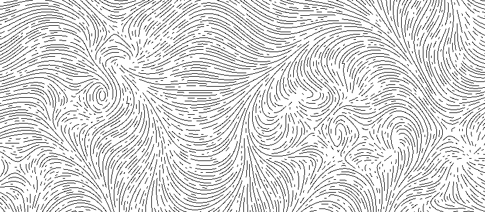

# About

Procedurally generate fingerprint-like textures.

Main entrypoints are in `gui.py` for a graphical interface, and `fingerprint.py` (which will also render to a graphical widget but without any user interaction). Images are exported as `.eps` vector graphics. 

Generation is somewhat slow and by no means optimal (I suggest you try to avoid interaction with the GUI while it's working...). But it works and can be tuned to your liking with relatively low effort. To help your exploration, here are a few guidelines:

1. The __seed__, __number of poles__, and __global flow parameters__ have the biggest impact on the result.
2. For faster generation, increase the __radius__ which governs the minimum distance between lines. 
3. If using the `Fingerprint` class directly you can specify the poles by hand.

---
> *Based on a program by [Reinder Nijhoff](https://turtletoy.net/turtle/70e2e00c6f)*
